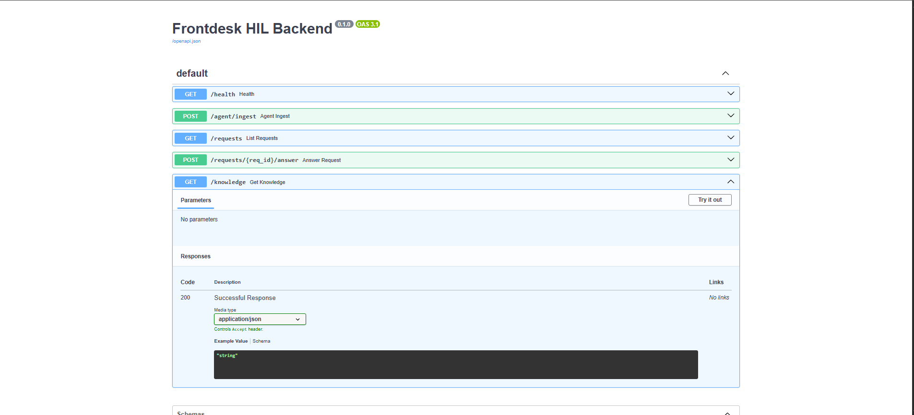

# Frontdesk AI: Human-in-the-Loop Supervisor System

This project is an intelligent, self-improving AI receptionist. It features a "Human-in-the-Loop" (HITL) system, allowing the AI to escalate unknown questions to a human supervisor, learn from their answers, and handle the entire request lifecycle.

This is a voice-only solution that uses OpenAI for speech-to-text and Silero for free text-to-speech.

# Core Components

The system is built on three main components:

1.  The Agent (`livekit/agent.py`): A fully voice-enabled LiveKit agent that handles real-time conversation using OpenAI STT and the free Silero TTS engine.

   
2.  The Backend (`backend/app.py`): FastAPI server that acts as the "brain," managing the knowledge base, request lifecycle (pending, resolved, timed-out), and serving the supervisor's admin panel.

   

3.  The Database (`backend/data.json`): A simple `TinyDB` file used as a lightweight, zero-setup database for the `knowledge_base` and `requests` tables

# Getting Started

Here’s how to get the project running on your local machine.

 1. Clone & Set Up Virtual Environment (Python 3.10)

This project requires **Python 3.10** for compatibility with the required libraries.

```bash
# Clone the repository
git clone [your-repo-url]
cd frontdesk-hil

# Create a Python 3.10 virtual environment
py -3.10 -m venv venv

# Activate the environment
# On Windows:
.\venv\Scripts\activate
# On macOS/Linux:
source venv/bin/activate

2. Install Dependencies
All required packages are in one command:
--> "pip install "livekit-agents[openai]==1.2.17" livekit-plugins-silero python-dotenv requests fastapi uvicorn tinydb pydantic python-multipart".

3.Set Up Environment
This project requires an OpenAI API key for the Speech-to-Text (STT) functionality.
Create a .env file in the root directory.
Add your OpenAI key. The file should look like this:
--> OPENAI_API_KEY=sk-xxxxXXXXXXXXXXXXXX
BACKEND_BASE=[http://127.0.0.1:8000](http://127.0.0.1:8000)

4.Run the System (in 2 Terminals!)
You'll need two separate terminals running at the same time.

Terminal A: Run the Backend
This starts the FastAPI server that manages all the logic.

 -->uvicorn backend.app:app --reload
📍 Supervisor Panel: http://127.0.0.1:8000/requests

Terminal B: Run the Agent
This connects the AI agent to your LiveKit room.

# Use any room name you like
 -->python livekit/agent.py connect --room frontdesk-demo
📍 Caller Sandbox: https://frontdesk-demo.sandbox.livekit.io


#My Design Philosophy & Decisions
Here's a breakdown of the key design decisions I made and the trade-offs I considered while building this project.

1. How "Help Requests" are Modeled
I chose TinyDB for its simplicity, splitting the data into knowledge and requests. The requests table is the heart of the HITL flow. I designed its schema to be clean and to track the full lifecycle of a customer's question:

request_id (str): A uuid to uniquely link the request from creation to resolution.

caller_id (str): The participant identity from LiveKit. This is crucial for knowing who to text back.

question (str): The final, transcribed question from the user.

status (str): Manages the lifecycle. Can be pending, resolved, or unresolved.

created_at (str): An ISO timestamp. This is essential for handling timeouts.

answer (str, optional): The answer provided by the supervisor upon resolution.

2. How the Knowledge Base is Updated
My philosophy here was "safety first." The knowledge base should only contain human-vetted information.

Therefore, the knowledge_base is only updated after a supervisor successfully submits an answer via the POST /resolve endpoint. This prevents the AI from learning from its own (or other) unverified sources and ensures the quality of its "memory".

3. How Supervisor Timeouts are Handled
The system needed to handle requests that are never answered. I wanted an elegant solution that didn't require a complex background worker or scheduler.

My solution is to handle timeouts gracefully on page load.

Every time the supervisor visits the /requests UI, the backend first does a quick check on all pending requests. It compares their created_at timestamp against a 2-hour threshold. Any request that is too old is automatically marked as status: 'unresolved' and moved to the "Unresolved" section in the UI. This is a simple, stateless, and effective way to meet the requirement.

4. How to Scale from 10 to 1,000+ Requests/Day
The current TinyDB (a single JSON file) is a clear bottleneck and would fail under concurrent writes. To handle real scale, I would make the following changes:

Database: Swap TinyDB for a production-grade database like DynamoDB or a managed PostgreSQL (AWS RDS).

Decouple with a Message Queue: This is the most important change. Instead of a direct HTTP call from the agent to the backend, the agent would just publish a message to a queue (like AWS SQS or RabbitMQ). This makes the agent's response instant ("I'll find out...") and makes the whole system more resilient.

Backend Workers: A separate pool of auto-scaling workers would consume from this queue to create the DB entries and notify supervisors.

Real Notifications: The print() "text-back" simulation would be replaced with a real Twilio (SMS) or Slack API call.

5. How the System is Modularized
I was deliberate about separation of concerns. The system is split into two modules that communicate via a simple API contract.

The Agent (The "Mouth and Ears"): Its only job is real-time I/O. It handles the LiveKit connection and the STT/TTS pipeline. It knows nothing about the database or the supervisor UI.

The Backend (The "Brain"):Gpt-4o-mini-tts Its only job is business logic. It manages data, state, and the UI.

This modularity is clean. We could swap the LiveKit agent for a Twilio bot tomorrow, and the backend wouldn't need to change at all.

#Future Improvements
If I had more time, here's what I would improve next:

Smarter Matching: The current question.matches() is a basic string search. I'd upgrade this to a vector search (e.g., using sentence-transformers) for "fuzzy" semantic matching of user questions.

Supervisor Auth: The admin panel is currently public. I would put this behind a simple login system.

Real Callbacks: I'd replace the print() statement with a real webhook call to a service like Twilio to send an actual SMS to the caller_id.

Phase 2: I would implement the "Phase 2" live-transfer logic, where the agent first checks a supervisor's availability (perhaps via a Redis key) before offering to transfer the call.
